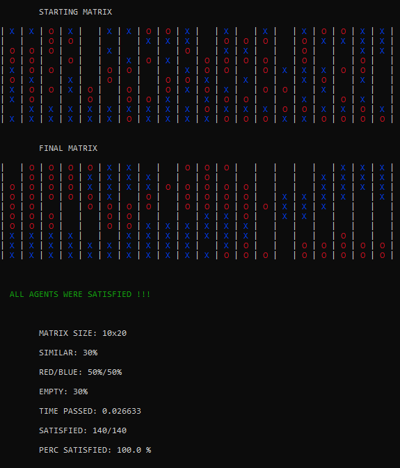
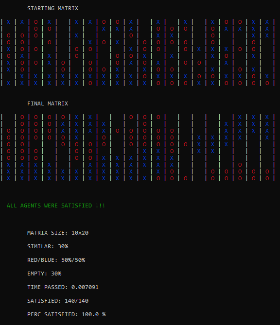
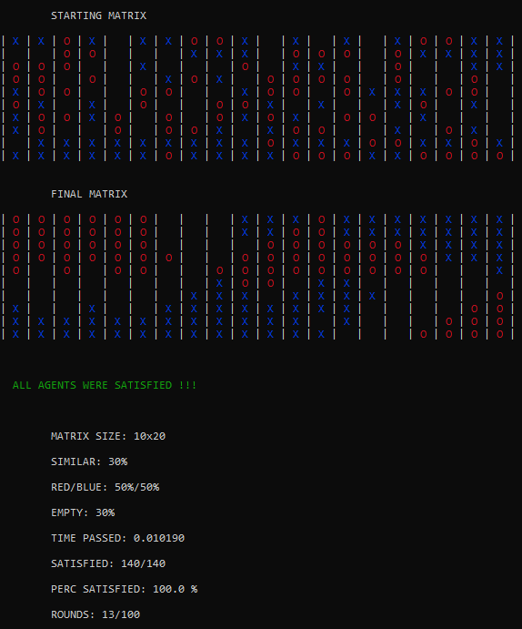
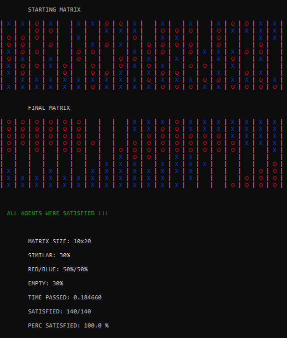
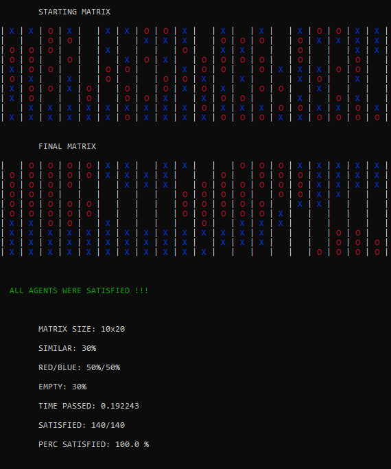
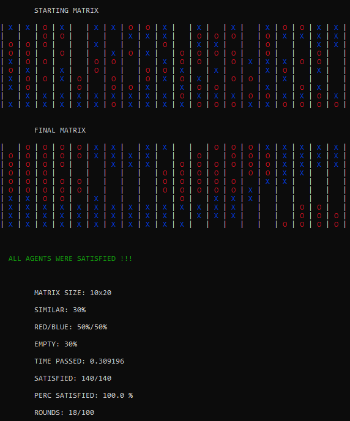

# [Schelling's-Model-of-Segregation](http://nifty.stanford.edu/2014/mccown-schelling-model-segregation/)

| **Petrazzuolo Lorenzo** | **0522500894** | **23/08/2021** |
| --- | --- | --- |

Progetto per l'esame di _Programmazione Concorrente, Parallela e sul Cloud_ dell'anno di corso _2020/2021_. 
Laurea magistrale in Computer Science, curriculum in Cloud Computing.
___
## **Indice**

- [**Introduzione**](#introduzione)
  - [_Il modello di segregazione di Schelling_](#il-modello-di-segregazione-di-Schelling)
  - [_Descrizione del problema_](#descrizione-del-problema)

- [**Dettagli implementativi**](#dettagli-implementativi)
  - [_Creazione Matrice_](#creazione-matrice)
  - [_Distribuzione Matrice_](#distribuzione-matrice)
  - [_Calcolo soddisfazione_](#calcolo-soddisfazione)
  - [_Riposizionamento insoddisfatti_](#riposizionamento-insoddisfatti)
  - [_Ricomposizione Matrice_](#ricomposizione-matrice)
  - [_Stampa dei risultati_](#stampa-dei-risultati)

 - [**Note sull'implementazione**](#note-sullimplementazione)
   - [_Compilazione_](#compilazione)
   - [_Esecuzione_](#esecuzione)

- [**Benchmarks**](#benchmarks)
   - [_Strong Scalability_](#strong-scalability)
   - [_Weak Scalability_](#weak-scalability)

- [**Correttezza**](#correttezza)

- [**Conclusioni**](#conclusioni)


___

## Introduzione 

### _Il modello di segregazione di Schelling_

Nel 1971, l'economista americano Thomas Schelling creò un modello basato su agenti che evidenziava il fatto che la segregazione era anche risultato di comportamenti involontari. Più precisamente, il modello poneva la luce sulla possibilità che un individuo o agente potesse allontanarsi involontariamente dagli altri agenti nel tempo per motivi razziali, economici o sociali.

Sebbene il modello sia abbastanza semplice, fornisce uno sguardo affascinante su come gli individui potrebbero auto-segregarsi, anche quando non hanno un desiderio esplicito di farlo.
> _[Riferimenti](https://en.wikipedia.org/wiki/Schelling's_model_of_segregation)_


### _Descrizione del problema_

Nel seguente progetto si propone un'implementazione di una simulazione del modello di Shelling. Una volta impostati una serie di parametri, il programma dovrà essere in grado di descrivere graficamente le caratteristiche del modello. Più precisamente si suppone di avere due tipi di agenti _**X**_ e _**O**_ che andranno a comporre la popolazione di una matrice _**NxM**_. Fissata una soglia di soddisfazione, ogni agente si dirà soddisfatto se la percentuale delle celle limitrofe è del suo stesso tipo, altrimenti sarà un agente insoddisfatto e dovrà essere spostato randomicamente in un'altra cella vuota della matrice. Questo avviene ad ogni round fino a che:

- Tutti gli agenti della matrice sono soddisfatti

oppure

- Il numero di round ha oltrepassato il limite massimo di round

___
## Dettagli implementativi

Per la risoluzione del problema è stato scelto di usare **```C```** come linguaggio di programmazione e la libreria **```MPI (Message Passing Interface)```** per lavorare in logica distribuita. Dal seguente diagramma di flusso è possibile evidenziare i passi principali di computazione che hanno permesso di trovare una soluzione al quesito posto. Successivamente verranno illustrati i vari punti nel dettaglio.


### _Creazione Matrice_
Per effettuare la generazione della matrice è importante andare a definire il numero preciso di _**X**_, _**O**_ e **'  '** (celle vuote). Questo viene calcolato tramite il prodotto tra righe, colonne e valore percentuale di presenza di agenti di un certo tipo.

```c
int E = (ROWS*COLUMNS*PERC_E);
int O = (ROWS*COLUMNS-E)*PERC_O, X = (ROWS*COLUMNS-E)*PERC_X;
if(ROWS*COLUMNS != (O+E+X)) E+=(ROWS*COLUMNS)-(O+E+X);
```

Mediante la funzione _**create_matrix**_ è possibile generare una matrice di dimensioni fissate _**ROWSxCOLUMS**_ dove i valori delle celle sono scelti randomicamente tramite la funzione _**rand()**_ il cui seed viene fissato precedentemente in funzione del numero di secondi dell'ora locale oppure tramite un valore fissato scelto dall'utente. Ogniqualvolta viene inserito un agente, viene decrementato il suo contatore fino a riempire la matrice con le diverse categorie di agenti. 

```c
void create_matrix(char* mat, int E, int O, int X){

    int i, val_rand=0;
    //Seed per funzione di rand()
    time_t now = time(NULL);
    struct tm *tm_struct = localtime(&now);
    srand ( localtime(&now)->tm_sec );

    for(i=0; i<ROWS*COLUMNS; i++){
        val_rand=rand()%3;
        if(val_rand==0 && O>0){
            mat[i] = 'O';
            O--;
        }else if(val_rand==1 && X>0){
            mat[i] = 'X';
            X--;
        }else if(val_rand==2 && E>0){
            mat[i] = ' ';
            E--;
        }else{
            
            if(E>0){
                mat[i] = ' ';
                E--;
            }else if((val_rand==0 || val_rand==2) && (E==0 || O==0)){
                mat[i] = 'X';
                X--;
            }else if((val_rand==1 || val_rand==2) && (E==0 || X==0)){
                mat[i] = 'O';
                O--;
            }
        }
    }
}
```

### _Distribuzione Matrice_
Affinchè si distribuisca la matrice in maniera intelligente è importante andare a definire una struttura dati dedicata che permetta ad ogni processo di salvare la propria sottomatrice e altri indici della stessa utili per il calcolo della soddisfazione degli agenti.


```c
typedef struct{
    //Sottomatrice assegnata ad ogni thread 
    char *submatrix;
    
    //Valori per la suddivisione e ricomposizione matrice in funzione di una Scatter
    int *scounts_scatter;
    int *displ_scatter;

    //Valori per la suddivisione e ricomposizione matrice in funzione di una Gather
    int *scounts_gather;
    int *displ_gather;

} Info_submatrix;
```

La distribuzione della matrice di partenza avviene in base al numero di processi coinvolti e non è altro che la sua suddivisione in righe. Al fine di calcolare in un secondo momento la soddisfazione degli agenti, si è scelto di ampliare la sezione di righe dedicata ai singoli thread di una o due righe supplementari, rispettivamente una per il primo (MASTER) e l'ultimo processo, due per i processi a cui sono dedicate sezioni "centrali" della matrice. In merito a ciò, _**scount_scatter**_ e _**displs_scatter**_ rappresentano rispettivamente il numero di elementi e gli indici delle sottomatrici con righe supplementari di ogni thread, _**scount_gather**_ e _**displs_gather**_ invece rappresentano il numero di elementi e gli indici delle sottomatrici effettive quindi senza righe supplementari dedicate ai singoli processi. I primi due array di valori utili per il calcolo della soddisfazione degli agenti, gli altri due utili per la ricomposizione della matrice.

```c
//Distribuzione matrice in sottomatrici per thread: calcolo size e displacements di tutte le sottomatrici dei vari thread
void distribute_matrix(Info_submatrix t_mat, int numproc){
        
        if(numproc>1){
            int i=0;
            int size_r_int = ROWS / numproc;    
            int size_r_rest = ROWS % numproc;

            for(i=0;i<numproc;i++){

                if(i<size_r_rest){
                    t_mat.scounts_scatter[i] = (size_r_int+1) * COLUMNS;
                    t_mat.scounts_gather[i] = (size_r_int+1) * COLUMNS;
                }
                else{
                    t_mat.scounts_scatter[i] = size_r_int * COLUMNS;
                    t_mat.scounts_gather[i] = size_r_int * COLUMNS;
                }

                if(i==0){
                    t_mat.scounts_scatter[i] += COLUMNS;
                    t_mat.displ_scatter[i] = 0;
                }else if(i==(numproc-1)){
                    t_mat.scounts_scatter[i] += COLUMNS;
                    t_mat.displ_scatter[i] = ROWS*COLUMNS - t_mat.scounts_scatter[i];
                }else{
                    t_mat.scounts_scatter[i] += COLUMNS*2;
                    t_mat.displ_scatter[i] = t_mat.displ_scatter[i-1] + t_mat.scounts_scatter[i-1] - COLUMNS*2;
                }
                t_mat.displ_gather[i] = i==0 ? 0 : t_mat.displ_gather[i-1] + t_mat.scounts_gather[i-1];   
            }
        }else{  //Un solo processo
            t_mat.scounts_scatter[0] = ROWS * COLUMNS;
            t_mat.displ_scatter[0] = 0;
            t_mat.scounts_gather[0] = ROWS*COLUMNS;
            t_mat.displ_gather[0] = 0;
        }
}
```

A questo punto, in base ai valori precedentemente calcolati, è possibile suddividere la matrice in sottomatrici e inviare ogni sezione al processo dedicato tramite una _**Scatterv**_

```c
//Suddivisione effettiva della matrice per i vari thread
MPI_Scatterv(mat, t_mat.scounts_scatter, t_mat.displ_scatter, MPI_CHAR, t_mat.submatrix, t_mat.scounts_scatter[myrank], MPI_CHAR, 0, MPI_COMM_WORLD);       
```

### _Calcolo soddisfazione_
Il calcolo della soddisfazione degli agenti viene effettuato da _**satisfaction_step**_ che restituisce sia il numero di celle soddisfatte sia una struttura dati dedicata alla memorizzazione di celle insoddisfatte e celle vuote, di seguito presentata.

```c
typedef struct{
    //Array composto dagli indici delle celle insoddisfatte
    char *unsatisfied;  
    //Numero di celle insoddisfatte         
    int n_unsatisfied;
    //Array composto dagli indici delle celle vuote            
    int *freeslots;           
    //Numero di celle vuote   
    int n_freeslots;             

} Info_cellpositions;
```

Per calcolare la soddisfazione di un agente è importante verificare dapprima il rango del processo per capire se si tratta di un thread a cui è stata dedicata una sottomatrice "centrale" oppure no. Una volta verificato ciò, se la cella è piena allora, in base all'indice, verrà chiamata un'apposita funzione che permetterà di calcolare i valori delle celle vicine:
1. per una cella angolo  
    - _**calc_firstangle**_ 
    - _**calc_secondangle**_ 
    - _**calc_thirdangle**_
    - _**calc_fourthangle**_

1. per una cella sulla cornice
    - _**calc_Ledge**_ = _Cornice sinistra_
    - _**calc_Redge**_ = _Cornice destra_
    - _**calc_Aedge**_ = _Cornice in alto_
    - _**calc_Bedge**_ = _Cornice in basso_

1. per una cella centrale
    - _**calc_center**_

Ad ognuna di queste funzioni verrà passata sia la propria sottomatrice che l'indice della cella in esame. Dopo aver calcolato il numero di celle vicine aventi come agente quello della cella passata, il calcolo della soddisfazione sarà dato dal confronto di due variabili: 
```c
return (similar_cells>=similarity);
```
dove similar_cells è il numero di celle vicine con lo stesso tipo di agente di quello in esame, mentre similarity rappresenta il grado di soddisfazione dato da: 
```c
float similarity = PERC_SIM*N; //Grado di soddisfazione 
```

> _Note_: Il valore **PERC_SIM** è la percentuale di soddisfazione che viene fissata prima della fase di compilazione ([**Note sull'implementazione**](#note-sullimplementazione)).
> Il valore **N** varia a seconda della posizione della cella: 
> - 3 per cella angolo 
> - 5 per cella cornice
> - 8 per cella centrale


Se il numero di celle vicine è maggiore o uguale al valore di similarity allora la cella in esame è soddisfatta e verrà restituito 1 come valore. 

___

```c
if(i==0) {
    if(calc_firstangle(t_mat)) local_satisfied++; 
    else{
        cellpos.unsatisfied[cellpos.n_unsatisfied]=t_mat.submatrix[i];
        cellpos.freeslots[cellpos.n_freeslots]=i;
        cellpos.n_freeslots++;
        cellpos.n_unsatisfied++;
        t_mat.submatrix[i]=' ';
    }
}
```

Prendendo come esempio il calcolo di _**first_angle**_, se il valore restituito è 1 allora viene incrementata la variabile di soddisfatti locali altrimenti:

1. L'indice della cella insoddisfatta viene salvato nell'array delle celle insoddisfatte;
1. L'indice della cella insoddisfatta viene salvato nell'array di celle vuote;
1. Il numero di celle vuote viene incrementato;
1. Il numero di celle insoddisfatte viene incrementato;
1. La cella insoddisfatta viene sostituita con una cella vuota.

Se invece la cella è vuota:
1. L'indice della cella vuota viene salvato nell'array di celle vuote;
1. Il numero di celle vuote viene incrementato.

Nel momento in cui ogni thread ha calcolato il numero delle celle soddisfatte della proprio sottomatrice, tramite una _**MPI_Allreduce**_ ogni processo determinerà il valore della soddisfazione globale, cioè quella dell'intera matrice

```c
MPI_Allreduce(&local_satisfied, &global_satisfied, 1, MPI_INT, MPI_SUM, MPI_COMM_WORLD);
```

### _Riposizionamento insoddisfatti_

Il riposizionamento degli insoddisfatti viene effettuato dalla funzione _displacements_step_. L'obiettivo qui è quello di aggiornare tutti i processi circa l'insieme delle celle insoddisfatte e l'insieme di celle vuote di tutti gli altri thread. Questo permette di tenere traccia sia del numero e degli indici delle celle vuote sia del numero e degli indici delle celle insoddisfatte così da costruire un array di valori che, una volta randomizzato, dia la possibilità di ricollocare gli agenti insoddisfatti in posizioni randomiche dell'intera matrice.

Più precisamente verranno fatte eseguire due _**Allgather**_ rispettivamente per il calcolo del numero di celle insoddisfatte per ogni thread e il calcolo del numero di celle vuote per ogni thread.

```c
MPI_Allgather(&cellpos.n_unsatisfied, 1, MPI_INT, number_of_unsatisfied_per_th, 1, MPI_INT, MPI_COMM_WORLD);

MPI_Allgather(&cellpos.n_freeslots, 1, MPI_INT, number_of_freeslots_per_th, 1, MPI_INT, MPI_COMM_WORLD);
```

Grazie alle informazioni contenute in _**number_of_unsatisfied_per_th**_ e _**number_of_freeslots_per_th**_ è possibile calcolare i displacements delle celle insoddisfatte e quelli delle celle vuote insieme ai quali si vanno a definire due array

- **all_freeslots** = Array di indici di celle vuote dell'intera matrice
- **total_unsat_freeslots** = Array di indici di celle insoddisfatte dell'intera matrice

tramite due _**Allgatherv**_

```c
MPI_Allgatherv(cellpos.freeslots, cellpos.n_freeslots, MPI_INT, all_freeslots, number_of_freeslots_per_th, displs_freeslots, MPI_INT, MPI_COMM_WORLD);

MPI_Allgatherv(cellpos.unsatisfied, cellpos.n_unsatisfied, MPI_CHAR, total_unsat_freeslots, number_of_unsatisfied_per_th, displs_unsatisfied, MPI_CHAR, MPI_COMM_WORLD);
```

Siccome il numero di celle vuote è maggiore o uguale al numero di celle insoddisfatte è importante riempire _**total_unsat_freeslots**_ (che al momento contiene solo valori di agenti insoddisfatti) di celle vuote così da poterlo suddividere in sezioni, ognuna dedicata ad un processo. 

```c
//Prima di randomizzare l'array di celle insoddisfatte, viene riempito con ' ' (celle vuote) per far coincidere la size dell'array con il numero di celle vuote totali
for(i=unsatisfied; i<sum_number_freeslots; i++) total_unsat_freeslots[i]=' '; 
```

A questo punto è possibile randomizzare l'array, 

```c
void randomize ( char *arr, int n )
{
    for (int i = n-1; i > 0; i--)
    {
        int j = rand() % (i+1);
        swap(&arr[i], &arr[j]);
    }
}
```

sostituire i valori della sottomatrice con quelli presenti nell'array randomizzato

```c
//Vengono sostituiti i valori nei freeslots delle varie sottomatrici con i valori delle sezioni di total_unsatisfied in funzione del proprio rank 
for(i=0;i<cellpos.n_freeslots;i++) t_mat.submatrix[cellpos.freeslots[i]]=total_unsat_freeslots[displs_freeslots[myrank]+i];
```

e aggiornare le righe supplementari con i nuovi valori ricollocati nella loro nuova posizione all'interno della matrice. 

```c
//Prima di assegnare i nuovi valori delle celle insoddisfatti alle matrici dei vari thread, vengono aggiornate le righe supplementari utili al calcolo della soddisfazione al successivo round

if(myrank==0)   //Rank==0 -> MASTER quindi bisogna aggiornare solamente una riga supplementare cioè l'ultima della sottomatrice
    for(i=0; i<number_of_freeslots_per_th[1];i++){
        if(all_freeslots[displs_freeslots[1]+i]>=(COLUMNS*2)) break;
        else if(all_freeslots[displs_freeslots[1]+i]>=COLUMNS){
            t_mat.submatrix[t_mat.scounts_scatter[myrank]-COLUMNS+(all_freeslots[displs_freeslots[1]+i]%COLUMNS)] = total_unsat_freeslots[displs_freeslots[1]+i];
        }
    }
else if(myrank==(numproc-1)){   //Rank==(totale processi - 1) -> ULTIMO THREAD quindi bisogna aggiornare solamente una riga cioè la prima della sottomatrice
    for(i=0; i<number_of_freeslots_per_th[numproc-2];i++)
        if(all_freeslots[displs_freeslots[numproc-2]+i]>=(t_mat.scounts_scatter[numproc-2]-(COLUMNS*2))){
            t_mat.submatrix[all_freeslots[(displs_freeslots[numproc-2]+i)]%COLUMNS] = total_unsat_freeslots[displs_freeslots[numproc-2]+i];
        }
}
else{   //Rank compreso tra 0 e l'ultimo thread quindi bisogna aggiornare due righe supplementari, la prima e l'ultima della sottomatrice
    //PRIMA RIGA
    for(i=0; i<number_of_freeslots_per_th[myrank-1];i++)
        if(all_freeslots[displs_freeslots[myrank-1]+i]>=(t_mat.scounts_scatter[myrank-1]-(COLUMNS*2)) &&  all_freeslots[displs_freeslots[myrank-1]+i]<(t_mat.scounts_scatter[myrank-1]-COLUMNS)){ 
            t_mat.submatrix[all_freeslots[displs_freeslots[myrank-1]+i]%COLUMNS] = total_unsat_freeslots[displs_freeslots[myrank-1]+i];
        }
    //ULTIMA RIGA
    for(i=0; i<number_of_freeslots_per_th[myrank+1];i++)
        if(all_freeslots[displs_freeslots[myrank+1]+i]>=COLUMNS && all_freeslots[displs_freeslots[myrank+1]+i]<(COLUMNS*2)){
            t_mat.submatrix[t_mat.scounts_scatter[myrank]-COLUMNS+(all_freeslots[displs_freeslots[myrank+1]+i]%COLUMNS)] = total_unsat_freeslots[displs_freeslots[myrank+1]+i];
        }
}
```

### _Ricomposizione Matrice_
Se tutti gli agenti sono soddisfatti o è stato superato il numero di round massimo, allora si esce dal ciclo, viene ricomposta la matrice finale e vengono stampati i risultati.

La ricomposizione della matrice avviene tramite la funzione _**recompose_mat**_ che non fa altro che generare un array con i valori della sottomatrice assegnata al processo e inviarlo tramite una _**Gatherv**_ al master.

```c
MPI_Gatherv(submatGather, t_mat.scounts_gather[myrank], MPI_CHAR, final_mat, t_mat.scounts_gather, t_mat.displ_gather, MPI_CHAR, 0, MPI_COMM_WORLD);
```
### _Stampa dei risultati_
La stampa dei risultati è l'ultimo passo del flusso di operazioni del programma. I dati stampati a video riguardano:

- Matrice iniziale e matrice finale
- Risultato ottenuto dalla computazione
    - Numero di celle soddisfatte
    - Percentuale di soddisfazione ottenuta
    - Tempo di computazione 
    - Numero di round raggiunto
- Parametri in input  
    - Taglia matrice 
    - Percentuale valori X, O e celle vuote
    - Percentuale di soddisfazione

___
## Note sull'implementazione 
Per rendere l'implementazione grafica più accattivante è stato pensato di dare la possibilità di visualizzare la matrice aggiornata ad ogni round, ovviamente a discapito delle prestazioni. Per questo motivo si consiglia di optare per questa scelta qualora non si vogliano misurare le performance del programma.

Per fare ciò è fondamentale la modifica dei valori **DELAY**, **PRINT_ROUNDS** e **PERFORMANCE**. Il primo per sospendere il processo master per secondi dopo la stampa della matrice aggiornata, il secondo valore per consentire la visualizzazione a video della matrice risultante mentre il terzo per autorizzare la stampa a sfavore delle prestazioni. 
```c
//Delay di attesa per round
#define DELAY 0

//'1' se si vuole stampare la matrice risultante ad ogni round
#define PRINT_ROUNDS 1          

//'1' se si vuole calcolare matrice risultante senza stampe a favore delle prestazioni
#define PERFORMANCE 0           
```

Inoltre, prima di effettuare la compilazione, è importante settare i valori utili per la costruzione della matrice, per il calcolo della soddisfazione e per il numero di round di computazione massimi.

```c
//Numero Colonne
#define COLUMNS 30

//Numero Righe
#define ROWS 30

//Numero Round Massimi
#define N_ROUND_MAX 300         

//Percentuale di 'O'
#define PERC_O 0.5              

//Percentuale di 'X'
#define PERC_X (1-PERC_O)       

//Percentuale di celle vuote
#define PERC_E 0.3              

//Percentuale di soddisfazione
#define PERC_SIM 0.3            
```

### _Compilazione_
Una volta settati tutti i parametri è possibile effettuare la fase di compilazione del codice con il seguente comando:

```c
mpicc -o prog prog.c
```
I requisiti di successo per quanto riguarda la compilazione e di conseguenza anche l'esecuzione del codice sono l'installazione di:
- Ubuntu Linux 18.04 LTS
- OpenMPI

### _Esecuzione_
Per effettuare la fase di esecuzione del codice, una volta generato il file _.out_ durante la fase di compilazione è possibile eseguirlo con il seguente comando:

```c
mpirun --allow-run-as-root -np N prog
```
> _**N**_ rappresenta il numero di processi
___
## Benchmarks
In fase di Benchmarking è stata misurata la scalabilità del programma in termini delle due nozioni principali di High Performance Computing, cioè _Strong Scalability_ e _Weak Scalability_. I test sono stati effettuati su un cluster di quattro macchine con sistema operativo _Ubuntu Linux 18.04 LTS_, della famiglia _t2.xlarge_ con _16GB di memoria_ e _4 vCPU_ ognuna. 

### _Strong Scalability_
La Strong Scalability può essere definita come il modo in cui il tempo di computazione varia, nella risoluzione di un problema di dimensione fissata, al variare del numero di processori. 
La misurazione di questo tipo di scalabilità permette di capire, da un lato, di quanto varia il tempo di computazione di un programma aumentando la parte di codice in parallelo rispetto a quella sequenziale e, dall'altro lato, qual è il limite superiore di processi coinvolti oltre il quale si rischia di estendere i tempi di calcolo a causa dell'overhead parallelo. 
Per definizione, la misurazione deve essere effettuata in base ad una dimensione fissata del problema calcolato da un numero variabile di processi. Per questo motivo è stato scelto di testare l'efficienza della Strong Scalability in funzione di una [formula](https://www.sharcnet.ca/help/index.php/Measuring_Parallel_Scaling_Performance):

- (_t1_ / (_N_ * _tN_)) * _100%_
> _**t1**_ = tempo di computazione di un singolo processo

> _**N**_ = numero processi coinvolti

> _**tN**_ = tempo di computazione di _N_ processi

#### _**Test-1 K/2 (2500x2000)**_
| **Righe** | **Colonne** | **Threads** | **Tempo 1** | **Tempo 2** | **Tempo 3** | **Efficienza** |
| :---: | :---: | :---: | :---: | :---: | :---: | :---: |
| 2500 | 2000 | 1 | 12,613839 | 12,620761 | 12,610214 | 100% |
| 2500 | 2000 | 2 | 6,646243 | 6,644074 | 6,629937 | 94,97%|
| 2500 | 2000 | 4 | 4,477803 | **4,455112** | 4,467496 | 70,46% |
| 2500 | 2000 | 6 | 6,948272 | 6,7789 | 6,839108 | 30,27% |
| 2500 | 2000 | 8 | 7,328779 | 7,323284 | 7,192262 | 21,52% |
| 2500 | 2000 | 10 | 8,793001 | 8,318929 | 8,563753 | 14,35% |
| 2500 | 2000 | 12 | 8,147662 | 7,754639 | 8,234876 | 12,77% |
| 2500 | 2000 | 14 | 6,92885 | 7,097258 | 6,946975 | 12,70% |
| 2500 | 2000 | 16 | 8,136461 | 7,871201 | 8,091794 | 9,69% |

> *_Per il calcolo dell'efficienza sono stati presi in considerazione i tempi peggiori_


#### _**Test-2 K (5000x2000)**_
| **Righe** | **Colonne** | **Threads** | **Tempo 1** | **Tempo 2** | **Tempo 3** | **Efficienza** |
| :---: | :---: | :---: | :---: | :---: | :---: | :---: |
| 5000 | 2000 | 1 | 22,807374 | 22,706562 | 22,817516 | 100% |
| 5000 | 2000 | 2 | 15,707718 | 15,737176 | 15,815975 | 72,13% |
| 5000 | 2000 | 4 | 9,697376 | **9,660594** | 9,675218 | 58,82% |
| 5000 | 2000 | 6 | 14,07761 | 13,323792 | 13,267828 | 27,01% |
| 5000 | 2000 | 8 | 19,111812 | 18,422374 | 20,341324 | 14,02% |
| 5000 | 2000 | 10 | 15,792132 | 15,734468 | 15,559272 | 14,44% |
| 5000 | 2000 | 12 | 18,217392 | 18,031201 | 17,311761 | 10,43% |
| 5000 | 2000 | 14 | 14,850863 | 14,927343 | 14,749345 | 10,91% |
| 5000 | 2000 | 16 | 16,271422 | 15,993416 | 15,966075 | 8,76% |

> *_Per il calcolo dell'efficienza sono stati presi in considerazione i tempi peggiori_


#### _**Test-3 2K (10000x2000)**_
| **Righe** | **Colonne** | **Threads** | **Tempo 1** | **Tempo 2** | **Tempo 3** | **Efficienza** |
| :---: | :---: | :---: | :---: | :---: | :---: | :---: |
| 10000 | 2000 | 1 | 49,179175 | 49,347264 | 49,205463 | 100% |
| 10000 | 2000 | 2 | 35,39052 | 35,373937 | 35,464182 | 69,57% |
| 10000 | 2000 | 4 | 21,200705 | **21,17713** | 21,258909 | 58,03% |
| 10000 | 2000 | 6 | 32,048546 | 30,198325 | 30,616614 | 25,66% |
| 10000 | 2000 | 8 | 33,514537 | 32,541497 | 33,063533 | 18,40% |
| 10000 | 2000 | 10 | 37,897307 | 38,500395 | 37,473097 | 12,81% |
| 10000 | 2000 | 12 | 34,740301 | 34,479201 | 35,489891 | 11,58% |
| 10000 | 2000 | 14 | 32,819148 | 32,225567 | 32,608265 | 10,74% |
| 10000 | 2000 | 16 | 32,937963 | 33,445424 | 33,151032 | 9,22% |

> *_Per il calcolo dell'efficienza sono stati presi in considerazione i tempi peggiori_


### _Weak Scalability_
La Weak Scalability può essere definita come il modo in cui il tempo di computazione varia in funzione del numero di processori, per una dimensione del problema fissata per processore.
La misurazione di questo tipo di scalabilità permette di capire quanto un programma è scalabile in funzione dell'aumento delle risorse richieste per processore. L'obiettivo è quello di avere dei tempi di esecuzione costanti con un aumento lineare della dimensione del problema.
La misurazione deve essere effettuata in base ad un aumento fissato della dimensione del problema per il numero di processori coinvolti. Per questo motivo è stato scelto di testare l'efficienza della Weak Scalability in funzione di una [formula](https://www.sharcnet.ca/help/index.php/Measuring_Parallel_Scaling_Performance):

- (_t1_ / _tN_) * _100%_
> _**t1**_ = tempo di computazione di un singolo processo

> _**tN**_ = tempo di computazione di _N_ processi

| **Righe** | **Colonne** | **Threads** | **Tempo 1** | **Tempo 2** | **Tempo 3** | **Efficienza** |
| :---: | :---: | :---: | :---: | :---: | :---: | :---: |
| 2000 | 2000 | 1 | 8,607591 | 8,625888 | 8,645915 | 100% |
| 4000 | 2000 | 2 | 12,138668 | 12,213413 | 12,202741 | 70,79% |
| 6000 | 2000 | 4 | 12,581904 | 12,588319 | 12,614354 | 68,54% |
| 8000 | 2000 | 6 | 22,022071 | 21,743886 | 22,085999 | 39,14% |
| 10000 | 2000 | 8 | 32,980166 | 31,744703 | 32,340681 | 26,21% |
| 12000 | 2000 | 10 | 40,823197 | 39,834169 | 40,741302 | 21,17% |
| 14000 | 2000 | 12 | 49,732282 | 51,737642 | 51,075773 | 16,71% |
| 16000 | 2000 | 14 | 59,512686 | 57,37106 | 58,915781 | 14.52% |
| 18000 | 2000 | 16 | 69,99322 | 68,117497 | 69,723649 | 12,35% |

> *_Per il calcolo dell'efficienza sono stati presi in considerazione i tempi peggiori_
___

### Risultati
I risultati mostrati permettono di evidenziare i miglioramenti prestazionali che si possono avere con l'introduzione della programmazione parallela. Più precisamente, per quanto riguarda la Strong Scalability, è possibile notare nei tre test effettuati che il tempo migliore è stato ottenuto dall'esecuzione del programma da 4 processori sottolineando il fatto che la distribuzione del lavoro è stata svolta nel migliore dei modi. Purtroppo, con l'aumento dei processori coinvolti, c'è stato un notevole incremento della comunicazione parallela che ha portato ad aumentare i tempi di elaborazione.
Anche riguardo la Weak Scalability sono stati ottenuti ottimi risultati, infatti i tempi di computazione rimangono lineari fino all'utilizzo di 4 processori per poi aumentare drasticamente. 
In entrambi i casi si può dire che, in termini di tempi computazionali, la risoluzione del problema viene svolta al meglio da 4 processori mentre l'efficienza può essere attribuita all'utilizzo di 2 processori. 


## Correttezza
Per verificare la correttezza del codice la soluzione migliore sarebbe quella di valutare le operazioni che vengono effettuate sui singoli agenti della matrice da parte di ognuno dei processi ma, siccome viene utilizzato un generatore pseudocasuale di valori per le posizioni degli agenti insoddisfatti, è impossibile prevedere gli spostamenti che vengono fatti. Per questo motivo, la soluzione più valida potrebbe essere quella di dimostrare che due esecuzioni del codice con funzione di randomizzazione settata su un seed predefinito a parità di processi, generano lo stesso output, quindi la stessa matrice risultante. 

Di seguito è riportato il test su 2, 4 e 6 processi con seed della funzione di randomizzazione fissato a 1, taglia matrice 40x40 (30% celle vuote, restante parte divisa in parti uguali tra valori X e valori O) e percentuale di soddisfazione al 30%.

_**2 Processi**_

| _Test 1_ | _Test 2_ |
|--- | --- |
|  |  |

_**4 Processi**_

| _Test 1_ | _Test 2_ |
|--- | --- |
|  |  |

_**6 Processi**_

| _Test 1_ | _Test 2_ |
|--- | --- |
|  |  |
___

## Conclusioni
In conclusione si pu\'o affermare che la risoluzione del problema con l'utilizzo della programmazione distribuita ha portato ad ottimi risultati che sottolineano ancora il fatto di quanto le prestazioni possano migliorare con l'uso di un determinato numero di processori grazie alla distribuzione del carico di lavoro. Inoltre, l'implementazione di un modello coerente con quello ideato da T. Schelling ha permesso di capire ancor di più gli intenti e le finalità dell'economista statunitense.